# SISOP-3-2026-IT-041

| Nama                   | NRP        |
| ---------------------- | ---------- |
| Muhamad Sabilil Haq    | 5027251041 |

<details>
<summary>Daftar Isi</summary>

- [Soal 1: Present Day, Present Time](#soal-1-present-day-present-time)
  - [Penjelasan Umum](#penjelasan-umum)
  - [File `protocol.h`](#file-protocolh)
  - [File `wired.c`](#file-wiredc)
  - [File `navi.c`](#file-navic)
  - [Dokumentasi](#dokumentasi)
- [Soal 2: The Battle of Eterion](#soal-2-the-battle-of-eterion)
  - [Konsep Dasar Sistem](#konsep-dasar-sistem)
  - [Alur Umum Permainan](#alur-umum-permainan)
  - [File `Makefile`](#file-makefile)
  - [File `arena.h`](#file-arenah)
  - [File `orion.c`](#file-orionc)
  - [File `eternal.c`](#file-eternalc)
  - [Dokumentasi](#dokumentasi-1)
  - [Kendala](#kendala)

</details>


# Soal 1: Present Day, Present Time

## Penjelasan Umum

Pada soal ini, diminta untuk membangun sebuah sistem komunikasi berbasis jaringan yang disebut sebagai **The Wired**, yang terdiri dari dua komponen utama, yaitu **server** dan **client**. Sistem ini memungkinkan beberapa user untuk saling terhubung dan berkomunikasi secara real-time dalam satu jaringan yang sama.
Implementasi sistem ini dibagi ke dalam tiga file utama, yaitu:
-   `protocol.h` → sebagai **shared configuration**
-   `wired.c` → sebagai **server**
-   `navi.c` → sebagai **client**

**Arsitektur Sistem**

Sistem ini menggunakan arsitektur **client-server**, di mana:

-   **Protocol (`protocol.h`)**
    -   Berisi konfigurasi yang digunakan bersama oleh server dan client
-   **Server (`wired.c`)**
    -   Bertugas menerima koneksi dari client
    -   Mengelola daftar user yang sedang aktif
    -   Mendistribusikan pesan (broadcast) ke seluruh client
    -   Menyediakan fitur khusus untuk admin (The Knights)
    -   Menyimpan seluruh aktivitas ke dalam file `history.log`
-   **Client (`navi.c`)**
    -   Digunakan oleh user untuk terhubung ke server
    -   Mengirim dan menerima pesan secara asynchronous menggunakan thread
    -   Mendukung dua mode:
        -   **User biasa** → untuk chat
        -   **Admin (The Knights)** → untuk akses console khusus
  ---

## File ``protocol.h``

File `protocol.h` berfungsi sebagai **shared configuration** yang digunakan oleh server (`wired.c`) dan client (`navi.c`). Tujuan utama dari file ini adalah untuk memastikan bahwa kedua komponen menggunakan konfigurasi yang sama, sehingga komunikasi dapat berjalan dengan lancar.
Isi dari filenya adalah sebagai berikut:
```
#ifndef PROTOCOL_H
#define PROTOCOL_H

#define PORT 8080
#define BUFFER_SIZE 1024
#define MAX_CLIENTS 100
#define NAME_LEN 50

typedef struct {
    int socket;
    char name[NAME_LEN];
    int is_admin;
} Client;

#endif
```
Di dalamnya meliputi:

 1. Konstanta yang Digunakan

    `PORT 8080`: Menentukan port yang digunakan oleh server untuk menerima koneksi dari client.

    `BUFFER_SIZE 1024`: Menentukan ukuran buffer untuk pengiriman dan penerimaan data antar client dan server.

    `MAX_CLIENTS 100`: Menentukan jumlah maksimum client yang dapat terhubung secara bersamaan ke server.

    `NAME_LEN 50`: Menentukan panjang maksimum username yang dapat digunakan oleh client.

 2. Struktur `Client`

    Struct `Client` digunakan untuk merepresentasikan setiap user yang terhubung ke server. Struktur ini memiliki beberapa atribut:

    - `int socket`: Menyimpan file descriptor dari socket client yang digunakan untuk komunikasi.
    - `char name[NAME_LEN]`: Menyimpan nama user yang digunakan sebagai identitas unik dalam sistem.
    - `int is_admin`: Menandakan apakah client tersebut memiliki hak akses sebagai admin (`The Knights`) atau tidak.
---

## File `wired.c`

File `wired.c` merupakan  **server utama** dalam sistem _The Wired_. Server ini bertanggung jawab untuk menangani koneksi dari banyak client secara bersamaan, mengelola komunikasi antar client, serta menyediakan fitur khusus untuk admin. File ini terbagi menjadi beberapa bagian, yaitu sebagai berikut.

 **1. Liblary liblary yang digunakan**

Meliputi liblary-liblary yang dibutukhan dapat memakai fungsi yg sudah tersedia, contohnya `pthread.h` agar bisa melakukan `multithreading` dan juga `protocol.h` untuk menyamakan konfigurasi antara client dan server seperti port, ukuran buffer, serta struktur data yang digunakan.
```
#include <stdio.h>
#include <stdlib.h>
#include <string.h>
#include <unistd.h>
#include <arpa/inet.h>
#include <pthread.h>
#include <time.h>
#include <signal.h>

#include "protocol.h"
```
 **2. Inisialisasi Variabel Global**

 Pendeklarasian variabel global ini ditujukan agar data bisa diakses dan dibagikan antar thread/fungsi.
 ```
Client clients[MAX_CLIENTS]; #menyimpan seluruh client yang terhubung
int client_count = 0; #Menghitung jumlah client aktif
pthread_mutex_t lock; #mutex untuk menghindari race condition
time_t server_start; #waktu server mulai (untuk uptime)
int server_fd; #socket utama server
```
 **3. Logging System**

Fungsi ini digunakan untuk mencatat seluruh aktivitas ke dalam file `history.log` dengan format: `[YYYY-MM-DD HH:MM:SS] [System/Admin/User] [Status/Command/Chat]`
```
void log_event(const char *role, const char *msg) {
    FILE *f = fopen("history.log", "a");

    time_t now = time(NULL);
    struct tm *t = localtime(&now);

    fprintf(f, "[%04d-%02d-%02d %02d:%02d:%02d] [%s] [%s]\n",
        t->tm_year+1900, t->tm_mon+1, t->tm_mday,
        t->tm_hour, t->tm_min, t->tm_sec,
        role, msg);

    fclose(f);
}
```
 **4. Graceful Shutdown (SIGINT)**

Fungsi ini akan dijalankan ketika server menerima sinyal `interrupt`, seperti `Ctrl + C`.
```
void handle_sigint(int sig) {
    printf("\n[System] Server shutting down...\n");

    log_event("System", "SERVER SHUTDOWN");

    // close semua client
    pthread_mutex_lock(&lock);
    for (int i = 0; i < client_count; i++) {
        close(clients[i].socket);
    }
    pthread_mutex_unlock(&lock);

    close(server_fd);
    exit(0);
}
```
Jika fungsi ini terpanggil, secara umum alurnya seperti ini:
menampilkan notifikasi shutdown → mencatat ke log → mengunci mutex → menutup seluruh koneksi client → membuka mutex → menutup socket server → menghentikan program.

 **5. Utility Function**
 - **Cek Username**

   Digunakan untuk mengecek username agar tiap username berbeda (unique)
   ```
   int is_name_taken(char *name) {
    for (int i = 0; i < client_count; i++) {
        if (strcmp(clients[i].name, name) == 0)
            return 1;
    }
    return 0;
    }
   ```
 - **Broadcast Message**

   Fungsi ini aka mengirim pesan ke semua client, kecuali client pengirim. Menggunakan mutex agar aman saat multi-thread.
   ```
   void broadcast(char *msg, int sender) {
    pthread_mutex_lock(&lock);
    for (int i = 0; i < client_count; i++) {
        if (clients[i].socket != sender) {
            send(clients[i].socket, msg, strlen(msg), 0);
        }
    }
    pthread_mutex_unlock(&lock);
    }
   ```
 - **Remove Client**

   Fungsi ini digunakan untuk menghapus client dari list ketika `disconnect` dan menjaga konsistensi `client_count`
   ```
   void remove_client(int sock) {
    pthread_mutex_lock(&lock);
    for (int i = 0; i < client_count; i++) {
        if (clients[i].socket == sock) {
            clients[i] = clients[client_count - 1];
            client_count--;
            break;
        }
    }
    pthread_mutex_unlock(&lock);
    }
   ```
 **5. Admin System (The Knights)**
 - **Menu Admin**
   ```
   void admin_menu(int sock) {
    char menu[] =
        "=== THE KNIGHTS CONSOLE ===\n"
        "1. Check Active Entities (Users)\n"
        "2. Check Server Uptime\n"
        "3. Execute Emergency Shutdown\n"
        "4. Disconnect\n"
        "Command >> ";

    send(sock, menu, strlen(menu), 0);
    }
   ```
   Menampilkan menu admin:
   ```
   1. Check Active Entities (Users)
   2. Check Server Uptime
   3. Execute Emergency Shutdown
   4. Disconnect
   ```
 - **Handle Admin**

   Fungsi ini menangani seluruh command admin:

     `1 → Cek user aktif`: menghitung jumlah client non-admin dan mengirim hasil ke admin

     `2 → Cek uptime`: menghitung waktu sejak server start

     `3 → Shutdown`: menulis log dan menghentikan server

     `4 → Disconnect`: keluar dari admin mode
   ```
   void handle_admin(int sock) {
    char buffer[BUFFER_SIZE];

    while (1) {
        admin_menu(sock);
        int len = recv(sock, buffer, BUFFER_SIZE, 0);
        if (len <= 0) break;

        buffer[len] = '\0';
        buffer[strcspn(buffer, "\n")] = 0;

        if (strcmp(buffer, "1") == 0) {
            int count = 0;

            pthread_mutex_lock(&lock);
            for (int i = 0; i < client_count; i++) {
                if (!clients[i].is_admin) {
                    count++;
                }
            }
            pthread_mutex_unlock(&lock);

            char msg[100];
            snprintf(msg, sizeof(msg), "Active Users: %d\n", count);

            send(sock, msg, strlen(msg), 0);
            log_event("Admin", "RPC_GET_USERS");
        } else if (strcmp(buffer, "2") == 0) {
            time_t now = time(NULL);
            int uptime = (int)(now - server_start);

            char msg[100];
            snprintf(msg, sizeof(msg), "Server Uptime: %d seconds\n", uptime);

            send(sock, msg, strlen(msg), 0);
            log_event("Admin", "RPC_GET_UPTIME");

        } else if (strcmp(buffer, "3") == 0) {
            log_event("Admin", "RPC_SHUTDOWN");
            log_event("System", "EMERGENCY SHUTDOWN INITIATED");

            printf("[System] Server shutting down...\n");
            exit(0);

        } else if (strcmp(buffer, "4") == 0) {
            log_event("System", "The Knights disconnected");

            close(sock);
            pthread_exit(NULL);
        }
    }
   ```
 **7. Handle Client**

 Ini adalah bagian paling penting dalam server
 - **Login Phase**
   - Client diminta memasukkan nama:
     ```
     Enter your name:
     ```
   - Jika nama adalah **"The Knights"**:
     - Masuk ke proses autentikasi password
     - Jika salah → ulangi
     - Jika `/exit` → keluar
     - Jika benar → masuk admin mode
   - Jika user biasa:
     - Dicek apakah username sudah digunakan
     - Jika ya → diminta ulang
     - Jika tidak → lanjut
 - **Register Client**
   ```
   clients[client_count]
   ```
   - Menyimpan socket
   - Menyimpan nama
   - Menandai apakah admin
   - Menambah jumlah client
   - Mengirim log `<user>` connected
   - Menampilkan `<user> Connected to The Wired`
 - **Mode Admin**

    jika user adalah admin
 - **Mode Chat**

   untuk user biasa
   - Menerima pesan dari client
   - Jika `/exit` → keluar
   - Jika pesan biasa:
     - Format: ``[username]: pesan``
     - Dicatat ke log
     - Dikirim ke semua client lain (broadcast)
 - **Disconnect**

   Saat client keluar:
   - Log disconnect
   - Hapus dari list client
   - Tutup socket
```
void *handle_client(void *arg) {
    int sock = *(int *)arg;
    free(arg);

    char name[NAME_LEN];
    char buffer[BUFFER_SIZE];

    // ===== LOGIN =====
    while (1) {
        send(sock, "Enter your name: ", strlen("Enter your name: "), 0);

        int len = recv(sock, name, NAME_LEN, 0);
        if (len <= 0) {
            close(sock);
            pthread_exit(NULL);
        }

        name[len] = '\0';
        name[strcspn(name, "\n")] = 0;

        // ===== ADMIN FLOW =====
        if (strcmp(name, "The Knights") == 0) {
            char password[BUFFER_SIZE];

            while (1) {
                send(sock, "Enter Password or (/exit): ", strlen("Enter Password or (/exit): "), 0);

                int plen = recv(sock, password, BUFFER_SIZE, 0);
                if (plen <= 0) {
                    close(sock);
                    pthread_exit(NULL);
                }

                password[plen] = '\0';
                password[strcspn(password, "\n")] = 0;

                if (strcmp(password, "/exit") == 0) {
                    close(sock);
                    pthread_exit(NULL);
                }

                if (strcmp(password, "admin") == 0) {
                    send(sock, "[System] Authentication Successful. Granted Admin privileges.\n", 66, 0);
                    break;
                } else {
                    send(sock, "[System] Wrong password!\n", 25, 0);
                }
            }
            break;
        }

        // ===== USER NORMAL =====
        pthread_mutex_lock(&lock);
        int taken = is_name_taken(name);
        pthread_mutex_unlock(&lock);

        if (taken) {
            char msg[BUFFER_SIZE];
            snprintf(msg, sizeof(msg), "[System] username %s telah digunakan, masukkan username lain\n", name);
            send(sock, msg, strlen(msg), 0);
        } else {
            break;
        }
    }

    // ===== REGISTER CLIENT =====
    pthread_mutex_lock(&lock);
    clients[client_count].socket = sock;
    strcpy(clients[client_count].name, name);
    clients[client_count].is_admin = (strcmp(name, "The Knights") == 0);
    client_count++;
    pthread_mutex_unlock(&lock);

    char logmsg[BUFFER_SIZE];
    snprintf(logmsg, sizeof(logmsg), "User '%s' connected", name);
    log_event("System", logmsg);

    if (!clients[client_count - 1].is_admin) {
        char welcome[BUFFER_SIZE];
        snprintf(welcome, sizeof(welcome), "%s Connected to The Wired\n", name);
        send(sock, welcome, strlen(welcome), 0);
    }

    // ===== ADMIN MODE =====
    if (clients[client_count - 1].is_admin) {
        handle_admin(sock);
    }

    // ===== CHAT =====
    while (1) {
        int len = recv(sock, buffer, BUFFER_SIZE, 0);
        if (len <= 0) break;

        buffer[len] = '\0';
        buffer[strcspn(buffer, "\n")] = 0;

        if (strncmp(buffer, "/exit", 5) == 0)
            break;

        char msg[BUFFER_SIZE];
        snprintf(msg, sizeof(msg), "[%s]: %.900s", name, buffer);

        log_event("User", msg);
        broadcast(msg, sock);
    }

    snprintf(logmsg, sizeof(logmsg), "User '%s' disconnected", name);
    log_event("System", logmsg);

    remove_client(sock);
    close(sock);
    pthread_exit(NULL);
}
```
 **8. Main Server**

 - **Setup Server**
   - Inisialisasi socket
   - Set `SO_REUSEADDR`
   - Bind ke port (`8080`)
   - Listen koneksi
 - **Start Server**
   ```
   log_event("System", "SERVER ONLINE");
   ```
 - **Accept Client**
   ```
   accept()
   ```
   - Setiap client:
     - Dialokasikan memory
     - Dibuat thread baru (`pthread`)
     - Dijalankan `handle_client`

```
int main() {
    struct sockaddr_in server_addr;

    signal(SIGINT, handle_sigint);

    server_start = time(NULL);
    pthread_mutex_init(&lock, NULL);

    server_fd = socket(AF_INET, SOCK_STREAM, 0);

    int opt = 1;
    setsockopt(server_fd, SOL_SOCKET, SO_REUSEADDR, &opt, sizeof(opt));

    server_addr.sin_family = AF_INET;
    server_addr.sin_port = htons(PORT);
    server_addr.sin_addr.s_addr = INADDR_ANY;

    bind(server_fd, (struct sockaddr*)&server_addr, sizeof(server_addr));
    listen(server_fd, 10);

    log_event("System", "SERVER ONLINE");
    printf("[System] Server listening...\n");

    while (1) {
        int *client_sock = malloc(sizeof(int));
        *client_sock = accept(server_fd, NULL, NULL);

        pthread_t tid;
        pthread_create(&tid, NULL, handle_client, client_sock);
        pthread_detach(tid);
    }

    return 0;
}
```
---
## File `navi.c`

File `navi.c` merupakan implementasi dari **client** pada sistem _The Wired_. Client ini berfungsi sebagai perantara antara user dengan server, yang memungkinkan user untuk mengirim dan menerima pesan secara real-time. File ini terbagi menjadi beberapa bagian, yaitu sebagai berikut.

 **1. Liblary liblary yang digunakan**

Meliputi liblary-liblary yang dibutukhan dapat memakai fungsi yg sudah tersedia, contohnya `pthread.h` agar bisa melakukan `multithreading` dan juga `protocol.h` untuk menyamakan konfigurasi antara client dan server seperti port, ukuran buffer, serta struktur data yang digunakan.
```
#include <stdio.h>
#include <stdlib.h>
#include <string.h>
#include <unistd.h>
#include <arpa/inet.h>
#include <pthread.h>
#include <signal.h>

#include "protocol.h"

int sock;
```
 **2. Inisialisasi Variabel Global**

 Variabel ini digunakan untuk menyimpan **socket descriptor** yang menghubungkan client dengan server.
 ```
 int sock;
 ```
 **3. Handle Interrupt (SIGINT)**

Fungsi ini akan dijalankan ketika server menerima sinyal `interrupt`, seperti `Ctrl + C`.
```
void handle_sigint(int sig) {
        printf("\n[System] Disconnecting from The Wired...[press ENTER]\n");
            fflush(stdout);

                close(sock);
                    exit(0);
}
```
Jika fungsi ini terpanggil, secara umum alurnya seperti ini: Menampilkan pesan disconnect → Menutup koneksi socket → Menghentikan program

 **4. Thread Pengirim Pesan**

Fungsi ini berjalan pada thread terpisah dan bertugas untuk:
 - Menampilkan prompt `>`
 - Mengambil input dari user (`fgets`)
 - Menghapus newline agar format rapi
 - Mengirim pesan ke server
Sedangkan, Jika user mengetik `/exit`: Menampilkan notifikasi disconnect → Menutup socket → Menghentikan program
```
void *send_msg(void *arg) {
    char msg[BUFFER_SIZE];

    while (1) {
        printf("> ");
        fflush(stdout);

        if (fgets(msg, BUFFER_SIZE, stdin) == NULL)
            continue;

        // hapus newline biar rapi
        msg[strcspn(msg, "\n")] = 0;

        // kirim dengan newline manual
        char sendbuf[BUFFER_SIZE];
        snprintf(sendbuf, sizeof(sendbuf), "%.*s\n", BUFFER_SIZE - 2, msg);

        if (send(sock, sendbuf, strlen(sendbuf), 0) <= 0) {
            exit(0);
        }

        if (strcmp(msg, "/exit") == 0) {
            printf("[System] Disconnecting from The Wired...[press ENTER]\n");
            fflush(stdout);

            close(sock);
            exit(0);
        }
    }
}
```
 **4. Thread Pengirim Pesan**

Fungsi ini juga berjalan pada thread terpisah dan bertugas untuk:
 - Menerima pesan dari server
 - Menampilkan pesan ke terminal
 - Menampilkan kembali prompt `>`
Namun, JJika koneksi terputus: Menampilkan notifikasi → Menutup socket → Menghentikan program
```
void *recv_msg(void *arg) {
    char msg[BUFFER_SIZE];

    while (1) {
        int len = recv(sock, msg, BUFFER_SIZE, 0);

        if (len <= 0) {
            printf("\n[System] Disconnected from server. Tekan [enter] untuk keluar...");
            close(sock);
            exit(0);
        }

        msg[len] = '\0';

        // pindah ke baris baru biar ga ganggu input
        printf("\n%s\n", msg);

        // tampilkan lagi prompt
        printf("> ");
        fflush(stdout);
    }
}
```
 **8. Main Server**

 - **Login Phase**
   Pada bagian ini, client akan melakukan komunikasi awal dengan server:
   ```
   while (1) {
    recv(...)
   }
   ```
   - Alurnya: Menerima prompt dari server (misalnya: `Enter your name:`) → Mengirim input user ke server → Menunggu respon dari server
 - **Deteksi Mode**
   ```
   if (strstr(buffer, "Authentication Successful"))
   ```
   Client akan menentukan mode berdasarkan respon server:
    - Jika **Authentication Successful** → masuk mode admin
    - Jika **Connected to The Wired** → masuk mode user biasa
 - **Mode User (Chat)**
   ```
   pthread_create(...)
   ```
   Jika user biasa:
   - Membuat 2 thread:
     - Thread kirim (`send_msg`)
     - Thread terima (`recv_msg`)
   - Kedua thread berjalan bersamaan (asynchronous)
   Hal ini memungkinkan `User` tetap bisa mengetik Sambil menerima pesan dari user lain
 - **Mode Admin**
   ```
   while (1) {
    recv(...)
    }
   ```
   Jika admin:
   - Tidak menggunakan thread
   - Menggunakan loop biasa (blocking)
   Alurnya: Menerima menu dari server → Menampilkan ke terminal → Mengirim input command ke server
```
int main() {
    struct sockaddr_in server_addr;
    char buffer[BUFFER_SIZE];
    char input[BUFFER_SIZE];
    int len;
    int is_admin = 0;

    signal(SIGINT, handle_sigint);

    sock = socket(AF_INET, SOCK_STREAM, 0);

    server_addr.sin_family = AF_INET;
    server_addr.sin_port = htons(PORT);
    server_addr.sin_addr.s_addr = inet_addr("127.0.0.1");

    if (connect(sock, (struct sockaddr*)&server_addr, sizeof(server_addr)) < 0) {
        perror("connect");
        close(sock);
        return 0;
    }

    // ===== LOGIN PHASE =====
    while (1) {
        len = recv(sock, buffer, BUFFER_SIZE - 1, 0);

        if (len == 0) {
            printf("\n[System] Disconnected from server\n");
            close(sock);
            return 0;
        }

        if (len < 0) {
            perror("recv");
            close(sock);
            return 0;
        }

        buffer[len] = '\0';
        printf("%s", buffer);
        fflush(stdout);

        // server minta input
        if (strstr(buffer, "Enter your name:") != NULL ||
            strstr(buffer, "Enter Password or (/exit):") != NULL) {

            if (fgets(input, BUFFER_SIZE, stdin) == NULL) {
                close(sock);
                return 0;
            }

            send(sock, input, strlen(input), 0);
        }

        // ===== DETEKSI MODE =====
        if (strstr(buffer, "Authentication Successful") != NULL) {
            is_admin = 1;
            break;
        }

        if (strstr(buffer, "Connected to The Wired") != NULL) {
            is_admin = 0;
            break;
        }
    }

    // ===== MODE USER (CHAT) =====
    if (!is_admin) {
        pthread_t t1, t2;

        pthread_create(&t1, NULL, send_msg, NULL);
        pthread_create(&t2, NULL, recv_msg, NULL);

        pthread_join(t1, NULL);
        pthread_join(t2, NULL);
    }

    // ===== MODE ADMIN =====
    else {
        while (1) {
            int len = recv(sock, buffer, BUFFER_SIZE, 0);

            if (len <= 0) {
                printf("\n[System] Disconnected from server\n");
                break;
            }

            buffer[len] = '\0';
            printf("%s", buffer);
            fflush(stdout);

            if (strstr(buffer, "Command >>") != NULL) {
                if (fgets(input, BUFFER_SIZE, stdin) == NULL) {
                    break;
                }
                send(sock, input, strlen(input), 0);
            }
        }
    }

    close(sock);
    return 0;
}
```
---
## Dokumentasi

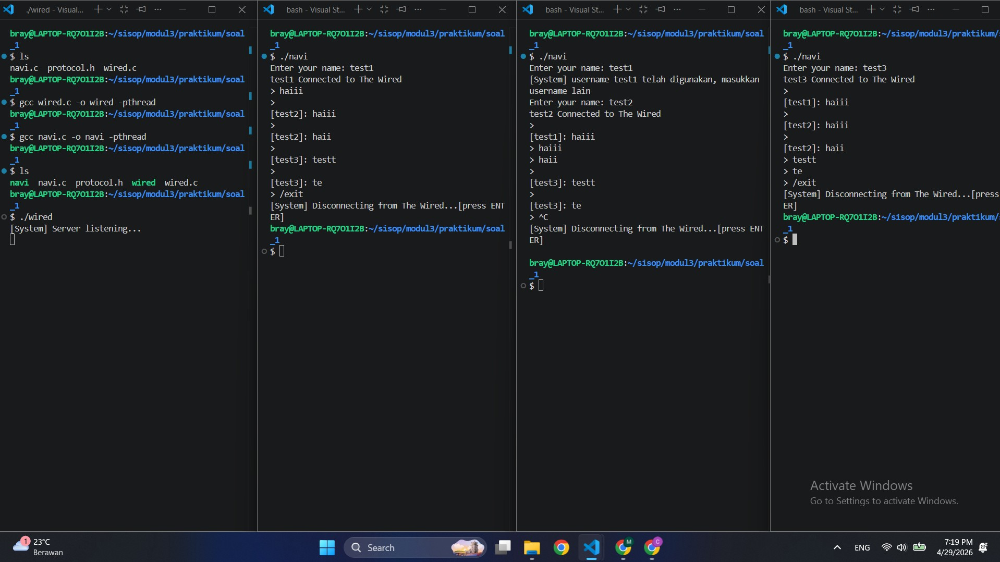

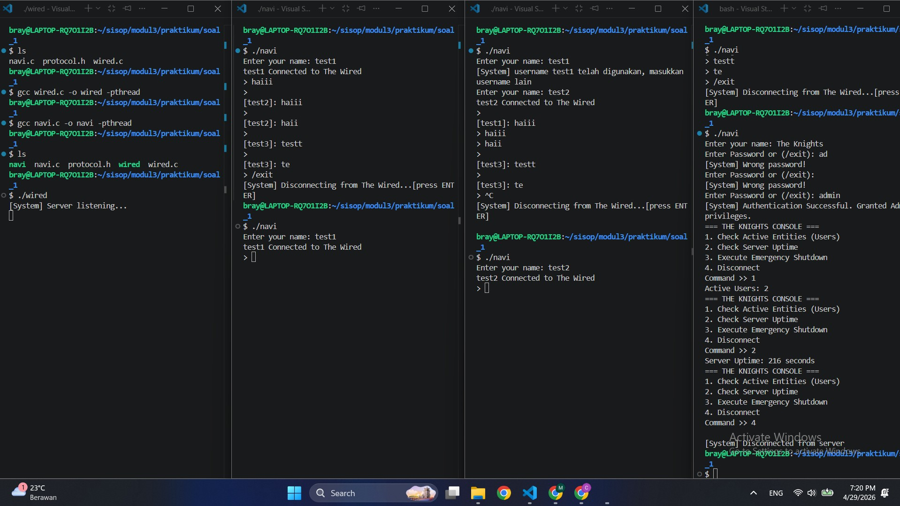

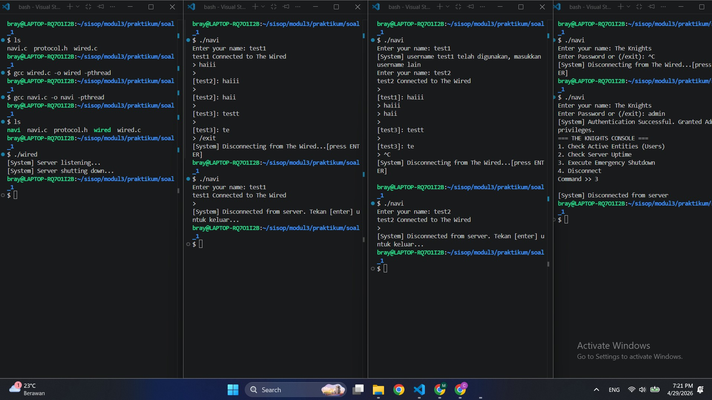

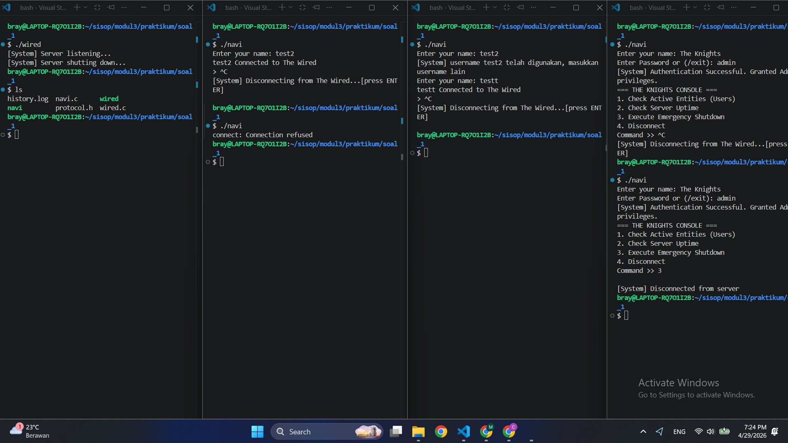

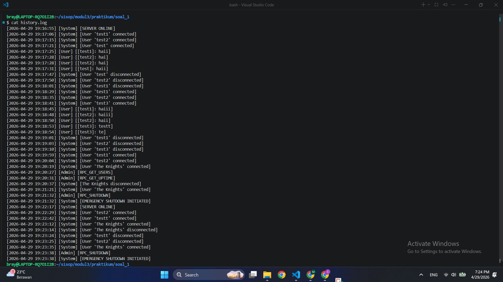

---

# Soal 2: The Battle of Eterion

Pada soal ini, diminta untuk membangun sebuah sistem permainan berbasis terminal bernama **Battle of Eterion**. Sistem ini dirancang menggunakan konsep _client-server_, di mana terdapat dua program utama, yaitu:

-   **`orion.c`** sebagai _server_
    
-   **`eternal.c`** sebagai _client_
    

Server bertugas untuk mengelola seluruh jalannya permainan, seperti proses autentikasi pengguna, matchmaking, sistem pertarungan, serta penyimpanan data. Sedangkan client berfungsi sebagai antarmuka bagi pengguna untuk berinteraksi dengan sistem. Selain kedua file utama tersebut, terdapat dua file pendukung lainnya, yaitu:

-   **`arena.h`** sebagai shared configuration yang digunakan oleh server dan client. File ini berisi struktur data utama seperti user, battle, serta konstanta yang digunakan dalam sistem.

-   **`Makefile`**
Digunakan untuk mempermudah proses kompilasi dan menjalankan program. Selain itu, file ini juga menyediakan perintah tambahan seperti membersihkan IPC (shared memory, message queue, dan semaphore) agar sistem dapat dijalankan kembali tanpa konflik.

----------

## Konsep Dasar Sistem

Sistem ini dibangun dengan memanfaatkan mekanisme **Inter-Process Communication (IPC)** yang terdapat pada Modul 3. Beberapa metode IPC yang digunakan antara lain:

-   **Shared Memory** → digunakan untuk menyimpan state global permainan (seperti data battle, user, dan matchmaking)
    
-   **Message Queue** → digunakan sebagai media komunikasi antara client dan server
    
-   **Semaphore** → digunakan untuk menjaga sinkronisasi agar tidak terjadi _race condition_ saat beberapa client mengakses data secara bersamaan
    

Dengan kombinasi ketiga mekanisme tersebut, sistem mampu menangani banyak client secara bersamaan (_concurrent users_) tanpa konflik data.

----------

## Alur Umum Permainan

Secara garis besar, alur sistem pada permainan ini adalah sebagai berikut:

1.  User menjalankan program client (`eternal`)
    
2.  User melakukan **register** atau **login**
    
3.  Setelah login, user dapat memilih beberapa fitur:
    
    -   **Battle** → masuk ke sistem matchmaking
        
    -   **Armory** → membeli senjata
        
    -   **History** → melihat riwayat pertarungan
        
    -   **Logout**
        
4.  Pada fitur **Battle**, sistem akan:
    
    -   Mencari lawan dalam waktu maksimal **35 detik**
        
    -   Jika tidak ditemukan lawan, user akan melawan **bot**
        
5.  Ketika pertarungan dimulai:
    
    -   Kedua pemain dapat melakukan aksi **attack [a]** atau **ultimate [u]**
        
    -   Sistem akan menghitung damage dan menentukan pemenang
        
6.  Setelah battle selesai:
    
    -   User akan mendapatkan **XP**
        
        -   Menang: +50 XP
            
        -   Kalah: +15 XP
            
    -   Riwayat pertarungan akan disimpan ke dalam file `history.db`
---
## File `Makefile`

File **Makefile** digunakan salah satunya untuk mempermudah proses kompilasi dan eksekusi program tanpa perlu menuliskan perintah `gcc` secara manual setiap kali ingin menjalankan program. Dengan adanya file ini, jika ingin melakukan kompilasi cukup dengan menuliskan perintah `make`. Selain itu, file ini juga mendukung beberapa opsi, seperti:
 - `clean`: Digunakan untuk menghapus file hasil kompilasi
 - `clear_ipc`: Digunakan untuk membersihkan resource IPC yang masih tersisa dari `Shared Memory`, `Message Queue`, dan `Semaphore`
```
CC = gcc
CFLAGS = -Wall -Wextra -O2 -std=c11 -pthread
LDFLAGS = -pthread

all: server client

server: orion.c arena.h
	$(CC) $(CFLAGS) orion.c -o orion $(LDFLAGS)

client: eternal.c arena.h
	$(CC) $(CFLAGS) eternal.c -o eternal $(LDFLAGS)

clean:
	rm -f orion eternal

clear_ipc:
	ipcs -m | grep 0x00001234 | awk '{print $$2}' | xargs -r ipcrm -m
	ipcs -q | grep 0x00005678 | awk '{print $$2}' | xargs -r ipcrm -q
	ipcs -s | grep 0x00009012 | awk '{print $$2}' | xargs -r ipcrm -s
```
---
## File `arena.h`

File `arena.h` berfungsi sebagai **shared configuration** yang digunakan bersama oleh `orion.c` sebagai server dan `eternal.c` sebagai client. Di dalam file ini, terdapat beberapa bagian penting, yaitu:

### 1. Liblary dan Konstanta yang Digunakan

Terdapat beberapa liblary yang dibutuhkan dan beberapa konstanta yang didefinisikan pada file ini digunakan untuk mengatur ukuran data, key IPC, serta batas maksimum dari beberapa komponen di dalam sistem.

* `USER_DB_FILE` dan `HISTORY_FILE` digunakan sebagai nama file penyimpanan data user dan history.
* `SHM_KEY`, `MQ_KEY`, dan `SEM_KEY` digunakan sebagai key untuk shared memory, message queue, dan semaphore.
* `MAX_USERNAME`, `MAX_PASSWORD`, `MAX_WEAPON`, `MAX_TEXT`, `MAX_LOGS`, `MAX_USERS`, `MAX_HISTORY`, dan `MAX_BATTLES` digunakan sebagai batas ukuran data agar sistem tetap stabil dan terkontrol.
```
#ifndef ARENA_H
#define ARENA_H

#define _POSIX_C_SOURCE 200809L

#include <errno.h>
#include <fcntl.h>
#include <signal.h>
#include <stdarg.h>
#include <stdbool.h>
#include <stdio.h>
#include <stdlib.h>
#include <string.h>
#include <sys/ipc.h>
#include <sys/msg.h>
#include <sys/sem.h>
#include <sys/shm.h>
#include <sys/stat.h>
#include <sys/types.h>
#include <time.h>
#include <unistd.h>

#define USER_DB_FILE "users.db"
#define HISTORY_FILE "history.db"

#define SHM_KEY 0x1234
#define MQ_KEY  0x5678
#define SEM_KEY 0x9012

#define MAX_USERNAME 32
#define MAX_PASSWORD 64
#define MAX_WEAPON   32
#define MAX_TEXT     1024
#define MAX_LOGS        5
#define MAX_USERS     256
#define MAX_HISTORY   256
#define MAX_BATTLES 16

/* Commands */
enum {
    CMD_REGISTER = 1,
    CMD_LOGIN,
    CMD_LOGOUT,
    CMD_BATTLE_REQ,
    CMD_ATTACK,
    CMD_BUY_WEAPON,
    CMD_HISTORY,
    CMD_EXIT,
    CMD_PING
};

/* Responses */
enum {
    RESP_OK = 1,
    RESP_ERR,
    RESP_INFO,
    RESP_WAITING,
    RESP_BATTLE_START,
    RESP_BATTLE_UPDATE,
    RESP_BATTLE_END
};
```
---

### 2. Struktur `weapon_item_t`

Struktur ini digunakan untuk merepresentasikan item senjata yang tersedia di armory. Setiap senjata memiliki:

* `name` → nama senjata
* `cost` → harga senjata
* `bonus` → tambahan damage dari senjata tersebut

Kemudian, daftar senjata tersebut disimpan di dalam array `WEAPON_SHOP`.
```
typedef struct {
    char name[MAX_WEAPON];
    int cost;
    int bonus;
} weapon_item_t;

static const weapon_item_t WEAPON_SHOP[] = {
    {"Wood Sword", 100, 5},
    {"Iron Sword", 300, 15},
    {"Steel Axe", 600, 30},
    {"Demon Blade", 1500, 60},
    {"God Slayer", 5000, 150},
};

#define WEAPON_SHOP_COUNT ((int)(sizeof(WEAPON_SHOP) / sizeof(WEAPON_SHOP[0])))
```

---

### 3. Struktur `user_record_t`

Struktur ini menyimpan data utama setiap user yang terdaftar di sistem. Properti yang disimpan di dalamnya adalah:

* `username` → nama user
* `password` → password user
* `gold` → jumlah gold yang dimiliki
* `level` → level user
* `xp` → pengalaman user
* `weapon_name` → nama senjata yang sedang digunakan
* `weapon_bonus` → bonus damage dari senjata
* `logged_in_pid` → PID proses client yang sedang login

Struktur ini digunakan oleh server untuk menyimpan data user.
```
typedef struct {
    char username[MAX_USERNAME];
    char password[MAX_PASSWORD];
    int gold;
    int level;
    int xp;
    char weapon_name[MAX_WEAPON];
    int weapon_bonus;
    pid_t logged_in_pid;
} user_record_t;
```

---

### 4. Struktur `battle_state_t`

Struktur ini digunakan untuk menyimpan seluruh state pertempuran. Di dalamnya terdapat:

* status battle aktif atau tidak
* mode battle (`vs bot` atau `human vs human`)
* nama dan PID kedua pemain
* data user kedua pemain
* HP masing-masing pemain
* waktu attack terakhir
* log battle
* hasil akhir battle

```
typedef struct {
    int active;
    int mode; /* 1 = vs bot, 2 = human vs human */
    char p1_name[MAX_USERNAME];
    char p2_name[MAX_USERNAME];
    pid_t p1_pid;
    pid_t p2_pid;

    user_record_t p1_user;
    user_record_t p2_user;

    int p1_hp;
    int p2_hp;
    time_t p1_last_attack;
    time_t p2_last_attack;

    char logs[MAX_LOGS][MAX_TEXT];
    int log_count;
    char result[MAX_TEXT];
} battle_state_t;
```

---

### 5. Struktur `arena_state_t`

Struktur ini merupakan state utama yang disimpan di shared memory. Isinya meliputi:

* status inisialisasi arena
* data user yang sedang menunggu lawan (*waiting*)
* informasi waiting user
* array `battles[MAX_BATTLES]` untuk menyimpan banyak battle secara bersamaan

Dengan struktur ini, server dapat menangani lebih dari satu battle tanpa saling menimpa state battle lain.
```
typedef struct {
    int initialized;

    int waiting_active;
    char waiting_user[MAX_USERNAME];
    pid_t waiting_pid;
    time_t waiting_since;
    user_record_t waiting_user_record;

    int battle_active;
    battle_state_t battles[MAX_BATTLES];
} arena_state_t;
```

---

### 6. Struktur `ipc_msg_t`

Struktur ini digunakan sebagai format pesan yang dikirim melalui message queue. Data yang disimpan di dalamnya meliputi:

* command dan status response
* PID pengirim/penerima
* nilai tambahan seperti `value`, `gold`, `level`, `xp`, dan `weapon_bonus`
* informasi user, opponent, weapon, serta payload pesan

Struktur ini menjadi media komunikasi utama antara server dan client.
```
typedef struct {
    long mtype; /* destination pid */
    int cmd;
    int status;
    pid_t pid;
    int value;
    int value2;
    int gold;
    int level;
    int xp;
    int weapon_bonus;
    char username[MAX_USERNAME];
    char password[MAX_PASSWORD];
    char opponent[MAX_USERNAME];
    char weapon_name[MAX_WEAPON];
    char payload[MAX_TEXT];
} ipc_msg_t;
union semun {
    int val;
    struct semid_ds *buf;
    unsigned short *array;
};
```

---

### 7. Fungsi Bantuan (*Helper Functions*)

File ini juga berisi beberapa fungsi bantu yang digunakan oleh server dan client, di antaranya:

* `trim_newline()` → menghapus karakter newline dari string
* `safe_copy()` → menyalin string dengan aman ke buffer tujuan
* `pid_alive()` → mengecek apakah proses masih aktif
* `level_from_xp()` → menghitung level berdasarkan XP
* `calc_damage()` → menghitung besar damage user
* `calc_health()` → menghitung HP user
* `push_log()` → menyimpan log battle ke dalam array log
* `format_history_time()` → mengubah timestamp menjadi format tampilan seperti `[29/04/2026-16:06]`

Fungsi-fungsi ini membantu menjaga kode utama tetap lebih ringkas dan mudah dipahami.
```
static inline void trim_newline(char *s) {
    if (!s) return;
    size_t len = strlen(s);
    while (len > 0 && (s[len - 1] == '\n' || s[len - 1] == '\r')) {
        s[--len] = '\0';
    }
}

static inline void safe_copy(char *dst, const char *src, size_t dstsz) {
    if (!dst || dstsz == 0) return;
    if (!src) {
        dst[0] = '\0';
        return;
    }
    snprintf(dst, dstsz, "%s", src);
}

static inline int pid_alive(pid_t pid) {
    if (pid <= 0) return 0;
    if (kill(pid, 0) == 0) return 1;
    return errno == EPERM;
}

static inline int level_from_xp(int xp) {
    if (xp < 0) xp = 0;
    return 1 + (xp / 100);
}

static inline int calc_damage(const user_record_t *u) {
    if (!u) return 10;
    return 10 + (u->xp / 50) + u->weapon_bonus;
}

static inline int calc_health(const user_record_t *u) {
    if (!u) return 100;
    return 100 + (u->xp / 10);
}

static inline void push_log(char logs[MAX_LOGS][MAX_TEXT], int *log_count, const char *fmt, ...) {
    if (!logs || !log_count || !fmt) return;
    for (int i = MAX_LOGS - 1; i > 0; --i) {
        snprintf(logs[i], MAX_TEXT, "%s", logs[i - 1]);
    }
    va_list ap;
    va_start(ap, fmt);
    vsnprintf(logs[0], MAX_TEXT, fmt, ap);
    va_end(ap);
    if (*log_count < MAX_LOGS) (*log_count)++;
}

static inline void format_history_time(char *out, size_t outsz, time_t t) {
    struct tm tmv;
    localtime_r(&t, &tmv);
    strftime(out, outsz, "[%d/%m/%Y-%H:%M]", &tmv);
}

#endif /* ARENA_H */
```

---

## File `orion.c`

File `orion.c` merupakan bagian utama yang berperan sebagai **server** pada sistem *Battle of Eterion*. File ini bertugas untuk menangani seluruh proses yang terjadi di sisi server, mulai dari inisialisasi IPC, pengelolaan user, matchmaking, sistem pertarungan, hingga penyimpanan history.

---

### 1. Inisialisasi Global dan IPC

Pada bagian awal, terdapat beberapa variabel global yang digunakan untuk menyimpan resource IPC:

```
static int g_shmid = -1;
static int g_mqid = -1;
static int g_semid = -1;
static arena_state_t *g_state = NULL;
```

Variabel tersebut digunakan untuk:

* **Shared Memory (`g_shmid`)** → menyimpan state arena
* **Message Queue (`g_mqid`)** → komunikasi client-server
* **Semaphore (`g_semid`)** → sinkronisasi akses data
* **`g_state`** → pointer ke shared memory

---

### 2. Fungsi Semaphore

Untuk mencegah *race condition*, digunakan dua fungsi utama:

```
static void sem_lock(void) {
    struct sembuf op = {0, -1, 0};
    semop(g_semid, &op, 1);
}

static void sem_unlock(void) {
    struct sembuf op = {0, 1, 0};
    semop(g_semid, &op, 1);
}
```

* `sem_lock()` → mengunci akses shared memory
* `sem_unlock()` → membuka kembali akses

---

### 3. Pengiriman Response ke Client

Server mengirim response menggunakan fungsi:

```
static void send_reply(pid_t pid, int cmd, int status, ...)
```

Fungsi ini:

* mengisi struct `ipc_msg_t`
* mengirimkan data menggunakan `msgsnd`

Dengan ini, setiap client akan menerima response sesuai PID masing-masing.

---

### 4. Pengelolaan Data User

Server membaca dan menyimpan data user melalui:

```
static int load_users(user_record_t *users, int max_users) {
...
}
static int save_users(const user_record_t *users, int count) {
...
}
static int find_user_index(const user_record_t *users, int count, const char *username)
{...
}
```

Fungsi-fungsi ini digunakan untuk:

* membaca file `users.db`
* mencari user berdasarkan username
* menyimpan perubahan data user

---

### 5. Sistem History

History battle disimpan menggunakan:

```
static void append_history(const char *username, const char *opponent, const char *result,
                           int xp, int gold, int level, const char *weapon, int is_bot) {
...
}
```

Format yang digunakan:

```
[TIMESTAMP]|USER|OPPONENT|RESULT|XP
```

Contoh:

```
[29/04/2026-16:06]|set|BOT|LOSE|15
```

Sedangkan untuk menampilkan history digunakan:

```
static void format_history(const char *username, char *out, size_t outsz) {
...
}
```

Yang akan menghasilkan tampilan:

```
|TIMESTAMP|OPPONENT|RESULT|XP|
```

---

### 6. Sistem Matchmaking

Matchmaking diatur melalui shared memory:

* Jika belum ada user → masuk ke waiting
* Jika ada user lain → langsung battle
* Jika menunggu ≥ 35 detik → lawan BOT

Logika ini terdapat pada:

```
static void handle_battle_request(const ipc_msg_t *req) {
...
}
static void *watcher_thread(void *arg) {
...
}
```

---

### 7. Sistem Battle

Battle disimpan dalam:

```
g_state->battles[MAX_BATTLES]
```

Beberapa fungsi penting:

```
static battle_state_t *start_human_battle_locked(const user_record_t *u1, pid_t p1_pid,
                                                 const user_record_t *u2, pid_t p2_pid) {
...
}
static battle_state_t *start_bot_battle_locked(const user_record_t *u, pid_t p1_pid) {
...
}
```

Untuk proses serangan:

```
static int attack_locked(battle_state_t *b, const char *attacker_name, int attack_type,
                         char *info, size_t infosz, int *ended, int *attacker_side) {
...
}
```

Fungsi ini:

* menghitung damage
* mengurangi HP
* menentukan apakah battle selesai

---

### 8. Reward dan Update Data

Setelah battle selesai:

```
static void save_battle_users_and_history(battle_state_t *b, int attacker_side) {
...
}
```

Fungsi ini akan:

* memberikan XP dan gold
* menyimpan ke `users.db`
* mencatat history

Reward:

* Menang → +50 XP
* Kalah → +15 XP

Note: Tetapi status bot akan tetap seperti di awal saja, tidak akan berkembang.

---

### 9. Bot System (Thread)

Jika user melawan bot, server membuat thread:

```
pthread_create(..., bot_thread, ...) yang berada di fungsi watcher_thread()
```

Bot akan:

* menyerang otomatis setiap 1 detik
* menggunakan fungsi `attack_locked`
* Bot memiliki senjata bawaan, yaitu `Bot Fang` yang menjadikan basic attacknya bertambah

---

### 10. Handler Request Client

Server menerima request dari client melalui:

```
msgrcv(...)
```

Kemudian diproses dengan `switch` yang berada di `main`:

```
switch (req.cmd) {
    case CMD_LOGIN:
    case CMD_REGISTER:
    case CMD_BATTLE_REQ:
    case CMD_ATTACK:
    ...
}
```

Setiap command memiliki handler masing-masing:

* `handle_login`
* `handle_register`
* `handle_attack`
* `handle_history`
* dll

---

### 11. Fungsi `main`

Pada bagian ini, server akan melakukan inisialisasi seluruh komponen yang dibutuhkan sebelum mulai menerima request dari client.

---

#### a. Penanganan Sinyal

```
signal(SIGINT, on_signal);
signal(SIGTERM, on_signal);
```

Server menangani sinyal seperti `Ctrl + C` agar ketika program dihentikan:

* IPC (shared memory, message queue, semaphore) dibersihkan
* tidak meninggalkan resource yang “nyangkut”

---

#### b. Inisialisasi Shared Memory

```
g_shmid = shmget(SHM_KEY, sizeof(arena_state_t), IPC_CREAT | 0666);
g_state = (arena_state_t *)shmat(g_shmid, NULL, 0);
```

* `shmget()` → membuat / mengambil shared memory
* `shmat()` → meng-attach shared memory ke pointer `g_state`

Shared memory ini akan menyimpan seluruh state arena seperti:

* user waiting
* data battle
* status permainan

---

#### c. Inisialisasi Message Queue

```
g_mqid = msgget(MQ_KEY, IPC_CREAT | 0666);
```

Digunakan untuk:

* menerima request dari client
* mengirim response kembali ke client

---

#### d. Inisialisasi Semaphore

```
g_semid = semget(SEM_KEY, 1, IPC_CREAT | 0666);

union semun su;
su.val = 1;
semctl(g_semid, 0, SETVAL, su);
```

Semaphore di-set dengan nilai awal `1`, yang berarti:

* hanya satu proses yang boleh mengakses shared memory dalam satu waktu

---

#### e. Inisialisasi State Awal

```
if (g_state->initialized != 1) {
    memset(g_state, 0, sizeof(*g_state));
    g_state->initialized = 1;
}
```

Bagian ini memastikan bahwa:

* shared memory hanya di-reset saat pertama kali server dijalankan
* tidak menghapus data jika server restart secara tidak sengaja

Selain itu, beberapa field juga di-reset:

* waiting state
* battle state (`battles[i].active = 0`)

---

#### f. Menjalankan Watcher Thread

```
pthread_create(&watcher, NULL, watcher_thread, NULL);
pthread_detach(watcher);
```

Thread ini bertugas untuk:

* memantau user yang sedang menunggu matchmaking
* jika sudah 35 detik → otomatis dibuat battle melawan bot

---

#### g. Loop Utama Server

```
while (g_running) {
    ipc_msg_t req;
    msgrcv(g_mqid, &req, sizeof(req) - sizeof(long), 1, 0);
```

Loop ini akan:

* terus berjalan selama server aktif
* menerima request dari client melalui message queue

---

#### h. Pemrosesan Request

```
switch (req.cmd) {
    case CMD_REGISTER:
    case CMD_LOGIN:
    case CMD_BATTLE_REQ:
    case CMD_ATTACK:
    ...
}
```

Setiap request akan diarahkan ke handler masing-masing, seperti:

* `handle_login()`
* `handle_register()`
* `handle_attack()`
* `handle_history()`

---

#### i. Cleanup Saat Server Berhenti

```
cleanup_ipc();
```

Digunakan untuk:

* menghapus shared memory
* menghapus message queue
* menghapus semaphore

---
## File `eternal.c`

File `eternal.c` merupakan bagian yang berperan sebagai **client** pada sistem *Battle of Eterion*. File ini digunakan oleh user untuk berinteraksi dengan server, mulai dari login, memilih menu, hingga mengikuti pertarungan.

### 1. Inisialisasi Global dan IPC

Pada bagian awal, client menyiapkan beberapa variabel global untuk menyimpan resource IPC dan data user yang sedang aktif.

```c
static int g_shmid = -1;
static int g_mqid = -1;
static int g_semid = -1;
static arena_state_t *g_state = NULL;
static user_record_t g_user;
static int g_logged_in = 0;
static char g_password[MAX_PASSWORD];
```

Variabel tersebut digunakan untuk:

* menghubungkan client ke shared memory
* mengirim request ke server melalui message queue
* menyimpan data user yang sedang login
* menyimpan password agar bisa dipakai ulang setelah battle selesai

---

### 2. Fungsi Semaphore

Sama seperti pada server, client juga menggunakan semaphore ketika membaca shared memory.

* `sem_lock()` → mengunci akses shared memory
* `sem_unlock()` → membuka kembali akses shared memory

Fungsi ini digunakan agar client tidak membaca data battle yang sedang diubah oleh server pada waktu yang bersamaan.

---

### 3. Pengiriman dan Penerimaan Pesan

Client menggunakan message queue untuk berkomunikasi dengan server melalui beberapa fungsi berikut:

* `send_request()` → mengirim command ke server
* `recv_reply_block()` → menerima response secara blocking
* `recv_reply_nowait()` → menerima response tanpa menunggu

Dengan mekanisme ini, client bisa tetap responsif saat sedang berada di dalam battle atau menunggu response dari server.

---

### 4. Menampilkan Data User

Setelah login atau setelah menerima response dari server, data user akan disalin ke variabel lokal menggunakan fungsi:

```
static void load_user_from_msg(const ipc_msg_t *msg) {
...
}
```

Fungsi ini digunakan untuk memperbarui tampilan profile user agar sesuai dengan data terbaru yang dikirim server.

---

### 5. Tampilan Menu dan Profile

Client menampilkan banner utama dari fungsi `banner(void)` , profile user, serta menu pilihan yang dapat digunakan setelah login.

Menu yang tersedia adalah:

* `Battle` → masuk ke matchmaking
* `Armory` → membeli senjata
* `History` → melihat riwayat pertarungan
* `Logout` → keluar dari akun

Bagian ini menjadi antarmuka utama bagi user untuk berinteraksi dengan sistem.

---

### 6. Sistem Battle di Client

Sebelum battle dimulai, client akan masuk ke mode khusus dengan bantuan fungsi:

* `enable_raw_mode()`
* `disable_raw_mode()`
* `kbhit()`
* `read_key()`

Fungsi-fungsi ini digunakan agar client bisa membaca input secara langsung saat battle berlangsung.

Setelah itu, client akan:

* mengambil snapshot battle miliknya dari shared memory
* menampilkan status HP, damage, dan log battle
* mengirim command attack atau ultimate ke server

Tampilan battle diperbarui melalui:

* `get_my_battle_snapshot()`
* `draw_battle_screen()`
* `battle_loop()`

---

### 7. Alur Battle Request

Saat user memilih menu battle, client akan menjalankan:

```
static void battle_request_flow(void) {
...
}
```

Fungsi ini akan:

* mengirim request battle ke server
* menunggu hasil matchmaking
* jika lawan belum ditemukan, client menunggu sampai server mengirim battle start
* setelah battle selesai, client akan login ulang agar data profile kembali sinkron

---

### 8. Menu Armory, History, dan Logout

Selain battle, client juga menangani fitur lain seperti:

* `armory_flow()` → untuk membeli senjata
* `history_flow()` → untuk menampilkan history battle
* `logout_flow()` → untuk keluar dari akun dan menghapus status login di client

Fitur-fitur ini tetap dijalankan melalui request ke server agar data yang ditampilkan selalu konsisten.

---

### 9. Fungsi `main`

Pada fungsi `main`, client akan:

* menghubungkan diri ke IPC server
* menampilkan menu utama
* menunggu input user
* menjalankan fitur sesuai pilihan user

**Jika user belum login**, maka menu yang muncul adalah `register`, `login`, dan `exit`. **Jika sudah login**, maka menu yang muncul adalah `battle`, `armory`, `history`, dan `logout`.

---

## Dokumentasi

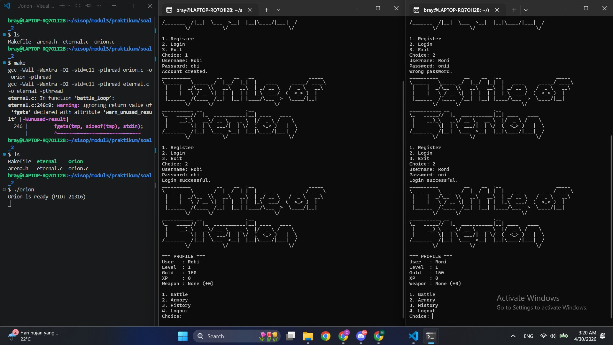

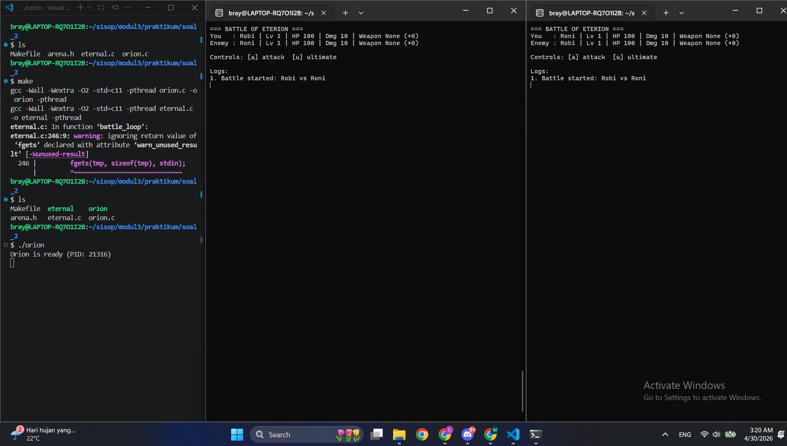

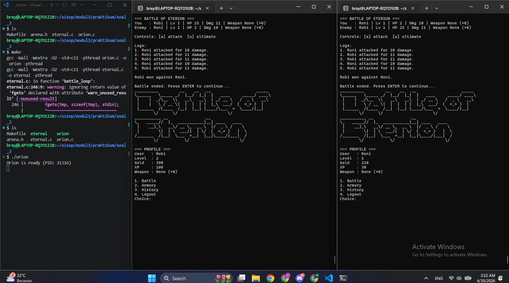

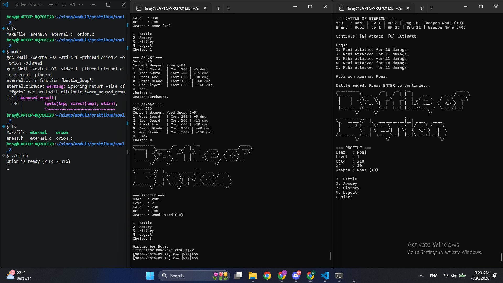

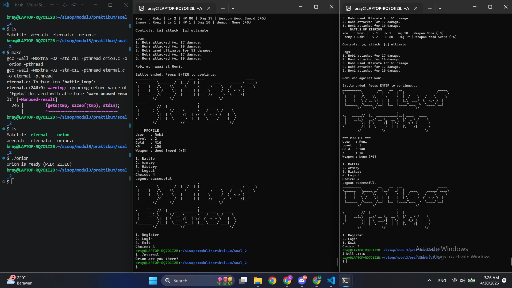

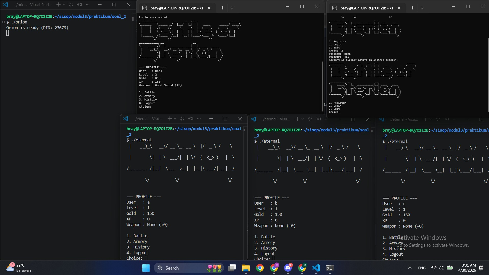

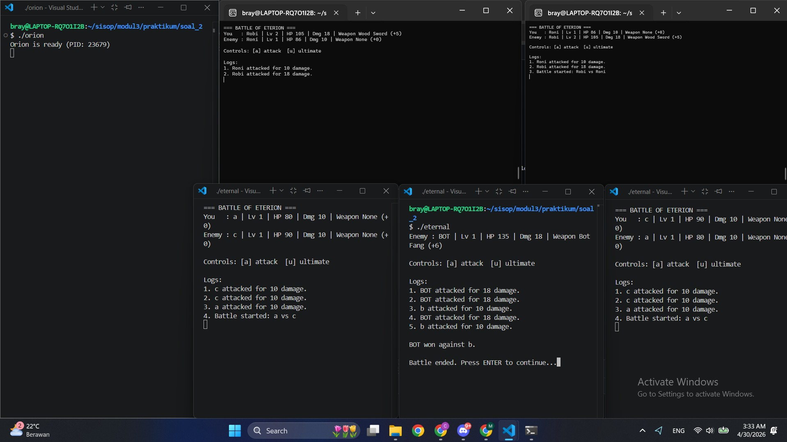

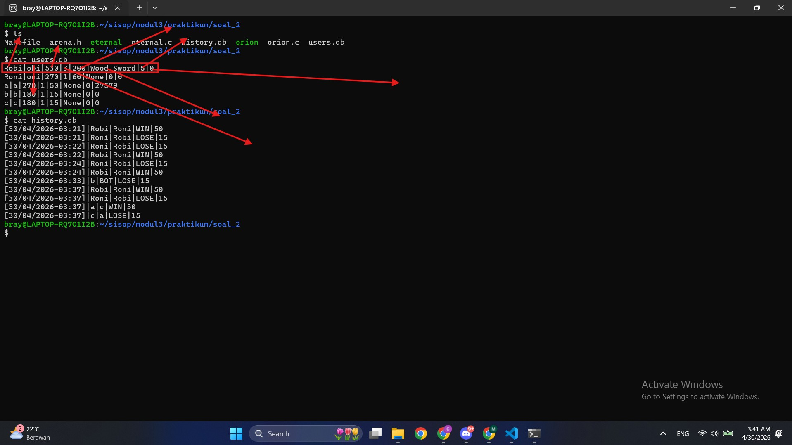


---

## Kendala
Soal yang terlalu kompleks, Ngerjainnya full AI

---